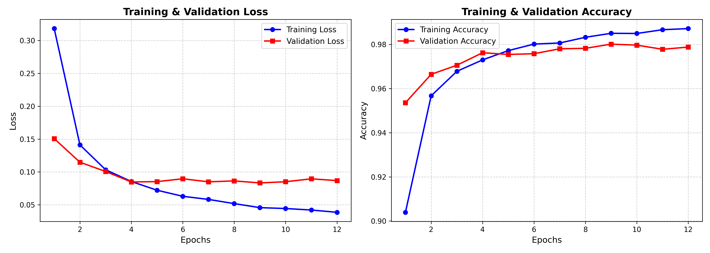
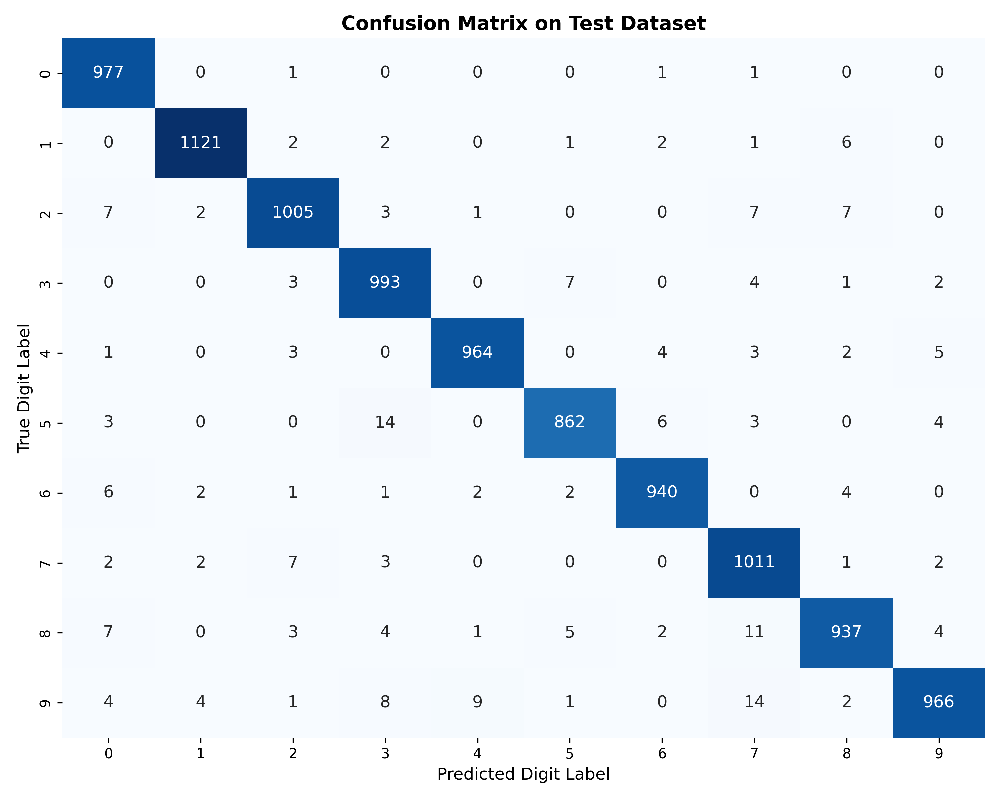
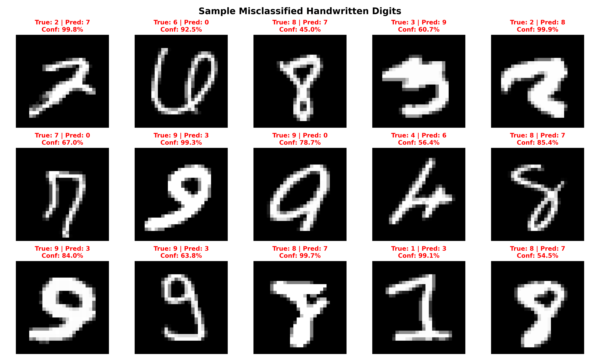

# ✍️ Handwritten Digit Recognition Neural Network & Live App

[](https://www.python.org/)
[](https://www.tensorflow.org/)
[](https://keras.io/)
[](https://streamlit.io/)

A complete end-to-end deep learning gateway project that trains a **Keras Sequential Neural Network** on the MNIST dataset, evaluates training performance metrics, and wraps the trained model inside a live interactive drawing canvas web application.

---

## 🌟 Key Highlights & Performance

- **Baseline Dense (MLP) Model**: **97.76% Test Accuracy**
- **Upgraded CNN Model**: **99.19% Test Accuracy**
- **Production Preprocessing Pipeline**: Bridges the domain gap between clean training set digits and messy, off-center real-world mouse/touch drawings using **Bounding Box Extraction** and **Center-of-Mass Alignment** (`cv2.moments`).
- **Interactive UI**: Real-time prediction badge, class probability breakdown bar chart, and preprocessed 28×28 input inspection preview.

---

## 📊 Loss Curves, Confusion Matrix & Error Analysis

### 1. Training & Validation Loss/Accuracy Curves
Visualizing the network's learning progression over epochs to monitor convergence and prevent overfitting using Dropout regularization.



---

### 2. Test Dataset Confusion Matrix Heatmap
Class-wise evaluation matrix across 10,000 unseen test digits, highlighting high classification accuracy across all digits (0–9).



---

### 3. Misclassification Visual Analysis
Inspection of sample misclassified test digits. Off-center strokes and ambiguous handwriting account for the vast majority of remaining edge-case errors.



---

## 🛠️ Computer Vision Preprocessing Pipeline (`utils.py`)

Standard MNIST training images are strictly centered **28×28 grayscale images** with white digits on a black background. User drawings from interactive web canvases are uncropped, off-center, and variable in stroke thickness.

Our vision pipeline transforms raw canvas inputs through 5 steps:

1. **Grayscale Conversion & Inversion**: Auto-detects stroke contrast to produce white (255) strokes on black (0) background.
2. **Bounding Box Isolation**: Crops non-zero drawing bounds (`cv2.boundingRect`).
3. **Aspect-Ratio Scaling**: Resizes digit into a standard 20×20 box preserving shape proportions.
4. **Canvas Padding**: Centers 20×20 digit into a 28×28 matrix with 4-pixel border.
5. **Center-of-Mass Alignment**: Calculates intensity moments (`cv2.moments`) and shifts image so the center of mass rests at `(14, 14)` matching MNIST standards.

---

## 📂 Project Structure

```
.
├── app.py                   # Streamlit web application with drawing canvas
├── train_model.py           # Training pipeline for Dense MLP & CNN models + plot generator
├── utils.py                 # Image preprocessing & center-of-mass alignment
├── test_utils.py            # Unit tests for preprocessing pipeline
├── export_weights.py        # Weights exporter for client-side JS forward pass
├── requirements.txt         # Project dependencies
├── digit_model.keras        # Trained Keras Dense Sequential model
├── cnn_model.keras          # Trained Keras CNN model
├── loss_accuracy_curves.png # Saved loss/accuracy visualization plot
├── confusion_matrix.png     # Saved confusion matrix heatmap plot
├── misclassifications.png   # Saved sample misclassifications plot
└── public/                  # Pure HTML5 + JS client-side web application
    ├── index.html           # In-browser web UI
    ├── script.js            # Canvas drawing & JS neural network forward pass
    └── weights.json         # Exported model weights & biases
```

---

## 🚀 Quick Start Guide

### 1. Clone & Install Dependencies
```bash
git clone https://github.com/AyushiRai21/-Handwritten-Digit-Recognition-Neural-Network.git
cd -Handwritten-Digit-Recognition-Neural-Network
pip install -r requirements.txt
```

### 2. Train Model & Generate Plots
```bash
python train_model.py
```

### 3. Launch Streamlit Live Web App
```bash
streamlit run app.py
```
Open **`http://localhost:8501`** in your web browser.

---

## 🎓 Gateway Deep Learning Concepts Covered

1. **Loss Curves & Convergence**: How training/validation loss curves reveal underfitting, overfitting, and optimal learning rate behavior.
2. **Dense MLP vs CNN Architecture**: Comparing flattened 784-dim linear transformations against 2D convolution filters that extract spatial hierarchies (edges, curves, loops).
3. **Handling Production Domain Gap**: Why clean benchmark dataset accuracy drops on real-world mouse drawings and how preprocessing restores model robustness.
